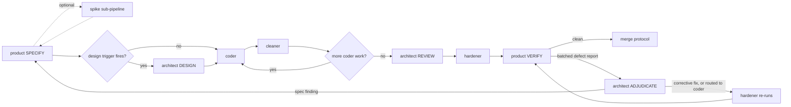
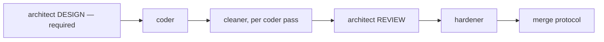
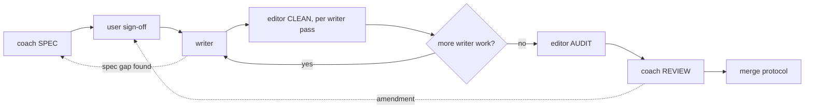

# Pipelines: the class of service per backlog item kind

<!-- reference-check: allow tasks.md -- a per-item artifact-name convention; no ready item carries one yet, and the marker goes stale (delete it) when the first does -->

**Audience:** the orchestrating seat, the `idea-*` skills, and the process roles — `coach`
reads this file. **Read when:** planning a promoted item's cycle, composing any role
invocation, and when an escalation interrupts a pipeline.

This file is the single source for the **between-invocation** facts. It says which steps run
for which kind, what each invoking prompt must carry, and where handoffs route. A role file remains the
single source for its **within-invocation** facts — its gates, its craft, its boundaries. So a
gates cell below cites the role's own file and never restates its list. Only commands the seat
itself runs appear literally.

Both sides of an invocation contract may exist. The role file
states what the role assumes or refuses. This file states what the seat must supply.

The kinds come from `.claude/references/definition-of-ready.md`'s kind check, which also maps
each to its SAFe orientation label. `kind:` sits in the promoted item's frontmatter, and it
**plans** the cycle below — it never authorizes a skip on its own.

## Per-item artifacts — the shape they owe

A `ready/` or `done/` item is a folder. `proposal.md` is the promoted idea file, and it keeps
the shape `backlog/IDEA-TEMPLATE.md` states. Every other file in that folder is a **per-item
artifact**, and it owes that shape nothing.

**A per-item artifact carries no frontmatter.** Its identity is positional. The folder names the
item and the basename names the artifact's job. A `name:` field would restate the folder and a
`title:` field the heading. `created:` restates what `git log --diff-filter=A` answers, and
`kind:` belongs to `proposal.md` alone.

**Open with a heading and an attribution line instead.** The heading names the artifact and its
item. The attribution line names the author and the date — a role with its mode, or the command
that wrote the file.

**One artifact carries frontmatter, and that exception is ruled rather than inherited.**
`assessment.md` begins beside the idea, before the folder exists, so no position identifies it
until the promotion moves it. That is the ground for every field it carries, not only for the git
blob id it stores. That blob id belongs to the assessed idea file, and no position supplies it at
any point. `.claude/references/definition-of-ready.md` names the fields.

**The kinds are not a closed set.** `scripts/board-shape-hook/board-shape.ts` classifies on two axes, and only one of them is a name lookup. The hook looks a lane up in `board-lanes.config.json`, so an undeclared lane draws its own refusal. A per-item artifact stays positional: any file at a folder lane's item depth that is neither the declared item nor an assessment record. So an artifact kind nobody has named yet is covered in an item's folder on the day it lands. `scripts/board-shape-hook/board-shape.meta.md` carries the axis-split ruling.

**The board hook checks no per-item artifact in an item's folder.** It prints a non-candidate line
rather than findings. Read that line as a refusal to assess, never as a pass. Vale's
`Board.NoStatusField` still reaches every board file, artifacts included.

**An assessment record is refused by its own path, in every lane, ahead of the candidate test.**
The hook reports the refusal and scores nothing, so read that line the way you read a
non-candidate line.

**Name the artifact's shape in the prompt of any role that writes one.** A role reaches this file
only when its own file or its invoking prompt sends it here.

## Story — contract-bearing

The finished state is reachable through the accessible tree, so it gets Gherkin and the full
cycle. Modes are named and optional steps marked.
**product (SPECIFY, with the optional spike sub-pipeline) → architect (DESIGN, when a trigger
fires) → coder → cleaner → architect (REVIEW) → hardener → product (VERIFY)**. The bare role
roster this decorates is the story cycle declared in `role-cycles.config.json`, pinned by
`agent-doc-check`'s check 4. A mode-bearing sequence is exempt from that check by design.

**The defect loop is part of the pipeline, not an exception to it.** `product` VERIFY closes
with either done or **one batched defect report**, routed to `architect` ADJUDICATE. Each
finding gets exactly one disposition: a corrective fix `architect` makes itself, a routing to
`coder`, or a return to `product` (SPECIFY) as a spec finding. Whenever an adjudicated fix
touches `src/`, `hardener` re-runs before `product` re-verifies. The seat holds the
two-round-trip budget per finding — see "State only the seat carries".

### The acceptance spike — an optional sub-pipeline of SPECIFY

A story may run the spike inside SPECIFY, before any implementing role starts; it is the
contract's feedback loop, not a mandatory stage. It exists because a signed-off spec whose
first real signal arrives five roles later is a spec nobody has tested:

1. `product` (SPECIFY) drafts the `.feature`, the step modules, and the outline. All red.
   Committed on the slice branch as provisional.
2. `architect` (CONTRACT) — optional. It reviews the contract, not code: is this observable
   through the UI at all, what accessible affordance is missing, is the altitude right?
3. `coder` — optional, and required only if step 4 is wanted. A throwaway-minimal spike
   implementation, never committed.
4. `product` (SPECIFY) runs its scoped acceptance-mutation pass — the command is
   `product.md`'s own — and refines. Step 4 exists only on the path where step 3 happened;
   with no implementation every mutant "kills" and the run measures nothing. A
   contract-review-only spike goes 1 → 2 → 6.
5. The seat discards the spike implementation.
6. `product` (SPECIFY) presents the refined contract and stops for user sign-off.

Skipping the sub-pipeline entirely is legitimate for a story whose contract carries no new
step vocabulary. The seat decides, and tells `hardener` whether a spike ran either way.
`product.md` carries the conduct that binds steps 1–6.

| Step | Role + mode                                                                                        | The prompt must carry                                                                                                   | Artifacts                                                         | Gates                        | Handoff                                                                              |
| ---- | -------------------------------------------------------------------------------------------------- | ----------------------------------------------------------------------------------------------------------------------- | ----------------------------------------------------------------- | ---------------------------- | ------------------------------------------------------------------------------------ |
| 1    | `product` SPECIFY                                                                                  | The mode by name; the proposal's content (no role reads a proposal file); the slice name                                | Writes `features/**`; reads `proposal.md` content from the prompt | Its own — see `product.md`   | Approved contract, outline, acceptance-mutation figure                               |
| 2    | `architect` DESIGN — only when a trigger in CLAUDE.md's "The optional architect design pass" fires | The mode by name; the approved contract; the design question                                                            | Writes `design.md` in the item's `ready/` folder                  | Its own — see `architect.md` | Ratified file set, interfaces, step ordering; `tasks.md` when dispatch is multi-unit |
| 3    | `coder` (repeat per design step)                                                                   | The approved `.feature` refs; the slice name; the design step when one exists                                           | Reads `features/**`, `design.md`; writes `src/`                   | Its own — see `coder.md`     | Changed-files manifest, test durations, ast-grep report                              |
| 4    | `cleaner` — see "Sequencing the seat owns"                                                         | Coder's manifest, carried forward verbatim; the slice name                                                              | Reads the manifest's files                                        | Its own — see `cleaner.md`   | What changed or that nothing did; survivor demonstrations                            |
| 5    | `architect` REVIEW                                                                                 | The mode by name; the slice name; `design.md` when a design pass ran                                                    | Reads the landed tree against `design.md`                         | Its own — see `architect.md` | Ruling; staleness report for the seat                                                |
| 6    | `hardener`                                                                                         | The manifest; whether an acceptance spike ran; any exemption instruction with its computed diff; slice, not integration | Reads the tree                                                    | Its own — see `hardener.md`  | Per-stage results; any skip named with its instruction                               |
| 7    | `product` VERIFY                                                                                   | The mode by name; read the committed artifacts, not memory                                                              | Writes `*.e2e.spec.ts`; runs its full acceptance-mutation pass    | Its own — see `product.md`   | Done, or one batched defect report routed to `architect` ADJUDICATE                  |

**Exit:** the merge protocol in `.claude/references/merge-protocol.md`, which is the source of
truth for landing. The item's folder moves `ready/` → `done/` after step 1's rebase and **before**
step 3's gate, so the gated tip is the true tip.

## Enabler-technical — checker-bearing

The diff lands in the tree the gates measure (`src/`, `scripts/`, configs, `rules/`), per
`definition-of-ready.md`'s sub-kind discriminator. The finished state is a check's reading,
so a `product` VERIFY pass has nothing to observe and **no `product` invocation runs in
either mode**. The kind plans that skip; the diff authorizes it. Before skipping, walk
**every** path in the diff and account for each, per `orchestration.md`'s "`product` VERIFY
does not run on a slice with no behaviour change". The same section says how to record the
moot merge step 8. The cycle, modes named:
**architect (DESIGN, required) → coder → cleaner → architect (REVIEW) → hardener**.

The steps are the story table's rows 2–6, with three differences:

- **The design pass is required, not trigger-conditional** — ruled by the user 2026-09-17. An
  Enabler has no `product` SPECIFY, so the DESIGN pass is its only pre-implementation gate. A
  Story has the spike and sign-off; an Enabler has only this. Row 2's
  "only when a trigger fires" condition applies to the Story pipeline alone.
- **Staleness recording stays with the seat.** A role reports what its change made stale in
  the process corpus; the seat records it per CLAUDE.md's Conventions. A substantive corpus
  change discovered inside a technical enabler is a split signal — it is `enabler-process`
  work, not a side edit.
- **Acceptance criteria are fitness functions**: name the check and both readings (before and
  after) in the proposal, per `definition-of-ready.md`'s checker-bearing T anchors.

**Exit:** as the story, minus step 8's figure — record the moot step per the
`orchestration.md` section cited above.

## Enabler-process — checker-bearing

The diff lands in the instructions that run the gates (`.claude/**`, CLAUDE.md,
`.claude/references/`, `adr/`, the board docs). No `product` runs, and the same
walk-every-path accounting applies. The cycle, modes named:
**coach (SPEC) → user sign-off → writer → editor (CLEAN, per writer pass) → editor (AUDIT)
→ coach (REVIEW)**. The bare roster this decorates is the process cycle declared in
`role-cycles.config.json`, pinned by `agent-doc-check`'s check 4.

| Step | Role + mode                        | The prompt must carry                                                                                | Artifacts                                      | Gates                     | Handoff                                                  |
| ---- | ---------------------------------- | ---------------------------------------------------------------------------------------------------- | ---------------------------------------------- | ------------------------- | -------------------------------------------------------- |
| 1    | `coach` SPEC                       | The mode by name; the proposal's content; the slice name                                             | Writes `spec.md` in the item's `ready/` folder | Its own — see `coach.md`  | The spec, stopped for user sign-off                      |
| 2    | `writer`                           | The paths of `spec.md` and every `amendment-<n>.md`; the item numbers this pass runs; the slice name | Edits exactly the files the spec names         | Its own — see `writer.md` | Changed-files manifest; declined or returned spec points |
| 3    | `editor` CLEAN — per `writer` pass | The mode by name; `writer`'s manifest, verbatim; the slice name                                      | Reads the manifest's files                     | Its own — see `editor.md` | What changed or that nothing did                         |
| 4    | `editor` AUDIT                     | The mode by name; the slice name                                                                     | Reads the corpus                               | Its own — see `editor.md` | Findings by file, or a measured clean                    |
| 5    | `coach` REVIEW                     | The mode by name; the paths of `spec.md` and every `amendment-<n>.md`; the slice name                | Reads the landed corpus against the spec       | Its own — see `coach.md`  | Cycle closed, or divergences named                       |

**The user gate sits at step 1's close**, on the `product` SPECIFY precedent. Governance
changes gate to the user at the spec; the closing review needs no second gate. `hardener`
runs at the merge protocol, not as a pipeline step.

### Amending a signed spec

A signed spec is the authority `writer` edits under, so changing it after sign-off needs its
own rule.

**Trigger.** `coach` REVIEW finds the landed corpus diverges from what the spec should say,
or the seat finds the spec under-specifies a point `writer` has reached. A `writer` that
cannot execute a spec point returns it and stops; that return is a trigger, never an
amendment.

**`coach` authors every amendment, in either mode. `writer` never does.** An executing role
editing its own authority is the boundary this pipeline holds. Hire `coach` in SPEC mode to
amend ahead of the review pass, and in REVIEW mode when the review itself finds the
divergence.

**An amendment is its own file, `amendment-<n>.md` beside the spec, numbered from 1 in
writing order.** It opens with its number and the date it was written. The spec and every
signed amendment are immutable once the slice starts, so the signed bytes stay the signed
bytes. A reader can then diff what was signed against what was proposed without
untangling appended sections.

**Each amendment names the spec items it supersedes, and supersedes nothing it does not
name.** The live instruction set is `spec.md` plus every amendment, read in number order,
with later text winning. No amendment restates the live set, because a restatement drifts as
the next amendment lands.

**An amendment opens by naming its item numbers, and `writer` reports the numbers it executed.**
The prompt names which of them this pass runs. `writer` reads the whole file, so that named set is
what bounds the pass rather than what the prompt happened to include.

**An amendment that replaces a block names every obligation the block carried that the
replacement does not.** A supersession row is true at block granularity and cannot show a
sentence leaving inside the block. So `coach` reads the replaced text against the replacement,
and records each dropped obligation as restored or as ruled out. The shapes to look for are in
`prose.md`, under "How a pass damages the file it cleans".

**Every amendment needs the user's re-sign-off.** An amendment changes something only the
user signed, so the original signature does not carry across it.

**The cycle then re-enters at step 2**, scoped to the files the amendment names. `editor`
CLEAN runs over `writer`'s new manifest, and `coach` REVIEW closes against the spec and
every amendment together.

**A second amendment on one slice states a stopping condition, a falsifier and a fallback.**
The stopping condition is a set of properties a reader can check without re-measuring. The
falsifier names the observation that means the shape is wrong rather than the wording. The
fallback says what to do instead of a further round. The seat does not run a further round
without all three.

**Exit:** as the story, minus step 8's figure — record the moot step per the
`orchestration.md` section cited above.

## Spike — knowledge-bearing

The finished state is a recorded answer to a named question. **No pipeline runs.** The seat, or
a single role invocation when the probe needs one, does the work. A readiness spike is still a
first-class slice: its own `ready/` folder, branch, and `slice/` tag.

- **Entry:** the folder's `proposal.md` names the parent idea and the letters it intends to
  move, per `definition-of-ready.md`.
- **The deliverable is `findings.md`** in the item's folder: the answer, its method, and its
  date. Throwaway artifacts go to `spikes/`.
- **It closes by re-assessing the parent.** A spike that moves no letter is itself a finding.
- **Exit:** gates that the diff can move (usually only the doc checkers), the `done/` move, the
  tag. `hardener`'s full sequence runs only when the spike's diff reaches `src/` or `scripts/`.

## Epic

An epic has no pipeline and no `ready/` folder. It lives in `backlog/ideas/` as an index and its
only work is the split into child candidates, per `definition-of-ready.md`'s epic disposition.
Each child then enters its own kind's pipeline above.

## The invocation contracts

Each of these is something a role expects the prompt to supply. A missing one either hard-fails
or, worse, succeeds wrongly.

- **`product` requires a mode.** SPECIFY or VERIFY, named — omitting it costs a round trip.
- **`coach` requires a mode.** SPEC or REVIEW, named — it refuses to guess, per its file.
- **`editor` requires a mode**, CLEAN or AUDIT, and CLEAN carries `writer`'s manifest
  verbatim — the `cleaner` manifest contract, in the process family.
- **`writer` receives the signed spec by path**, plus every amendment, the item numbers this
  pass runs, and the slice name. The prompt names `backlog/ready/<slice>/spec.md` and each
  `amendment-<n>.md`; no path named, no authority to edit.
- **A role reads a board path the prompt names, and never derives one.** That is the whole read
  carve-out: its own item's `spec.md` and `amendment-*.md`, at paths it was handed. Never glob,
  never list a directory, never build a read path from the slice name, and read nothing else
  under `backlog/`.
- **Writing a board file is a separate grant, and only a role's own file gives it.** `coach`
  SPEC builds `backlog/ready/<slice>/spec.md` from the slice name, because its own file names
  that deliverable. A write grant licenses no read.
- **Name `architect`'s mode, even for REVIEW.** An unnamed mode fails silently, and the wrong
  pass it returns looks plausible. This is the most dangerous contract in the set.
- **The mutation-invariant exemption exists only as a thing the seat says.** Compute the
  predicate with `npm run mutation-invariance -- --diff <range>`, name the diff, and put both
  in the prompt — and never read exit 1 as a pass. `.claude/references/merge-protocol.md` is the
  source of truth for the exit codes, the sequence, and `hardener`'s side of the contract.
- **An integration run must say so.** Post-merge, `hardener` on `main` is _verifying an
  integration rather than a slice_ — say that phrase in the prompt.
- **`cleaner`'s scope is `coder`'s handoff manifest.** Carry it forward into the prompt,
  verbatim.
- **The slice name goes into every downstream prompt.** For a board-originated slice it is the
  `ready/` folder's basename; only a slice with no board item gets its name from `product` in
  SPECIFY. It is also the branch, the worktree, and the `slice/<name>` tag.

## State only the seat carries

Roles are stateless between invocations. Two counters live here and nowhere else.

- **The two-round-trip budget on an adjudicated finding.** Nothing but the seat can count to
  two; a third appearance looks like a first to both roles. Hold the count and escalate to the
  user when it is reached.
- **Whether an acceptance spike ran.** Only the seat knows, and the `hardener` prompt needs
  telling. The seat also discards the spike implementation.

## Sequencing the seat owns

- **`cleaner` runs after every `coder` invocation**, not once after the last. Each pass gets a
  small diff instead of the union of every invocation.
- **`editor` CLEAN runs after every `writer` pass**, on the same reasoning.
- **Re-invoke `hardener` whenever an adjudicated fix touches `src/`**, before `product`
  re-verifies.
- **Do not widen `coder`'s scope.** Another role's work handed to it runs that work's gates
  twice, and ownership lives in the role files. A design step reading "module + unit **and
  property** suite" is a split into two invocations, not one.
- **The design pass is the seat's call, not `product`'s.** The triggers live in CLAUDE.md's
  "The optional architect design pass".

## Escalation lanes, as pipeline interrupts

Five lanes terminate at the seat. When one fires, the role has stopped and is waiting.

- **`product`, a finding outside the slice's changed-files manifest** — its own triage routes
  it here; it reports and stops.
- **`product` dissent** — `architect` is authoritative on code-vs-spec; **the user is
  authoritative on what the product should do**, and only the seat can reach the user.
- **`architect` ADJUDICATE, outside the changed-files manifest** — routed to the seat by name.
- **`hardener`, a gate failure outside the slice manifest** — reports and stops. The failure is
  a pre-existing break on `main` or something a rebase brought in, and both belong to the seat.
- **`writer`, a spec point it cannot execute** — it returns the point and stops. The seat hires
  `coach` to amend, per Amending a signed spec above.
