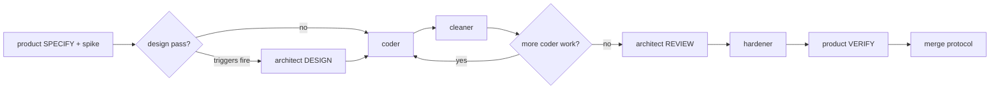
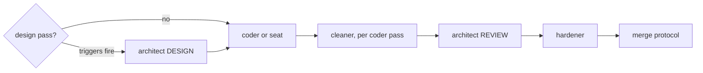

# Pipelines: the class of service per backlog item kind

<!-- reference-check: allow design.md -- a per-item artifact-name convention; no ready item carries one yet, and the marker goes stale (delete it) when the first does -->
<!-- reference-check: allow tasks.md -- a per-item artifact-name convention; no ready item carries one yet, and the marker goes stale (delete it) when the first does -->
<!-- reference-check: allow findings.md -- a per-item artifact-name convention; no ready item carries one yet, and the marker goes stale (delete it) when the first does -->

**Audience:** the orchestrating seat and the `idea-*` skills. **Read when:** planning a promoted
item's cycle, composing any role invocation, and when an escalation interrupts a pipeline.

This file is the single source for the **between-invocation** facts. It says which steps run
for which kind, what each invoking prompt must carry, and where handoffs route. A role file remains the
single source for its **within-invocation** facts — its gates, its craft, its boundaries. So a
gates cell below cites the role's own file and never restates its list. Only commands the seat
itself runs appear literally.

Both sides of an invocation contract may exist. The role file
states what the role assumes or refuses. This file states what the seat must supply.

The kinds come from `.claude/references/definition-of-ready.md`'s kind check, which also maps
each to its SAFe orientation label. `kind:` sits in the promoted item's frontmatter, and it
**plans** the cycle below — it never authorizes a skip on its own.

## Story — contract-bearing

The finished state is reachable through the accessible tree, so it gets Gherkin and the full
cycle: **product → coder → cleaner → architect → hardener → product**.

**The acceptance spike runs inside SPECIFY**, before any implementing role starts. It exists
because a signed-off spec whose first real signal arrives five roles later is a spec nobody has
tested:

1. `product` (SPECIFY) drafts the `.feature`, the step modules, and the outline. All red.
   Committed on the slice branch as provisional.
2. `architect` (CONTRACT) — optional. It reviews the contract, not code: is this observable
   through the UI at all, what accessible affordance is missing, is the altitude right?
3. `coder` — optional, and required only if step 4 is wanted. A throwaway-minimal spike
   implementation, never committed.
4. `product` (SPECIFY) runs its scoped acceptance-mutation pass — the command is
   `product.md`'s own — and refines. Step 4 exists only on the path where step 3 happened;
   with no implementation every mutant "kills" and the run measures nothing. A
   contract-review-only spike goes 1 → 2 → 6.
5. The seat discards the spike implementation.
6. `product` (SPECIFY) presents the refined contract and stops for user sign-off.

`product.md` carries the conduct that binds steps 1–6.

| Step | Role + mode                                                                                        | The prompt must carry                                                                                                   | Artifacts                                                         | Gates                        | Handoff                                                                              |
| ---- | -------------------------------------------------------------------------------------------------- | ----------------------------------------------------------------------------------------------------------------------- | ----------------------------------------------------------------- | ---------------------------- | ------------------------------------------------------------------------------------ |
| 1    | `product` SPECIFY                                                                                  | The mode by name; the proposal's content (no role reads the board); the slice name                                      | Writes `features/**`; reads `proposal.md` content from the prompt | Its own — see `product.md`   | Approved contract, outline, acceptance-mutation figure                               |
| 2    | `architect` DESIGN — only when a trigger in CLAUDE.md's "The optional architect design pass" fires | The mode by name; the approved contract; the design question                                                            | Writes `design.md` in the item's `ready/` folder                  | Its own — see `architect.md` | Ratified file set, interfaces, step ordering; `tasks.md` when dispatch is multi-unit |
| 3    | `coder` (repeat per design step)                                                                   | The approved `.feature` refs; the slice name; the design step when one exists                                           | Reads `features/**`, `design.md`; writes `src/`                   | Its own — see `coder.md`     | Changed-files manifest, test durations, ast-grep report                              |
| 4    | `cleaner` — see "Sequencing the seat owns"                                                         | Coder's manifest, carried forward verbatim; the slice name                                                              | Reads the manifest's files                                        | Its own — see `cleaner.md`   | What changed or that nothing did; survivor demonstrations                            |
| 5    | `architect` REVIEW                                                                                 | The mode by name; the slice name; `design.md` when a design pass ran                                                    | Reads the landed tree against `design.md`                         | Its own — see `architect.md` | Ruling; staleness report for the seat                                                |
| 6    | `hardener`                                                                                         | The manifest; whether an acceptance spike ran; any exemption instruction with its computed diff; slice, not integration | Reads the tree                                                    | Its own — see `hardener.md`  | Per-stage results; any skip named with its instruction                               |
| 7    | `product` VERIFY                                                                                   | The mode by name; read the committed artifacts, not memory                                                              | Writes `*.e2e.spec.ts`; runs its full acceptance-mutation pass    | Its own — see `product.md`   | Done, or one batched defect report routed to `architect` ADJUDICATE                  |

**Exit:** the merge protocol in CLAUDE.md, which is the source of truth for landing. The item's
folder moves `ready/` → `done/` after step 1's rebase and **before** step 3's gate, so the gated
tip is the true tip. Merge step 8 reads the acceptance-mutation figure from the VERIFY handoff.

## Enabler — checker-bearing

The finished state is a check's reading, so a `product` VERIFY pass has nothing to observe and
**no `product` invocation runs in either mode**. The kind plans that skip; the diff authorizes
it. Before skipping, walk **every** path in the diff and account for each, per
`orchestration.md`'s "`product` VERIFY does not run on a slice with no behaviour change". The
same section says how to record the moot merge step 8.

The steps are the story table's rows 2–6 unchanged, with two differences:

- **Surfaces no role may edit fall to the seat.** CLAUDE.md, articles, sidecars, role files, and
  reference files are the seat's to write, each edit with the user's explicit approval per
  CLAUDE.md's Conventions. An enabler that is mostly documentation is therefore mostly
  seat-executed, with `coder` and `cleaner` taking only the `src/` and `scripts/` share.
- **Acceptance criteria are fitness functions**: name the check and both readings (before and
  after) in the proposal, per `definition-of-ready.md`'s checker-bearing T anchors.

**Exit:** as the story, minus step 8's figure — record the moot step per the
`orchestration.md` section cited above.

## Spike — knowledge-bearing

The finished state is a recorded answer to a named question. **No pipeline runs.** The seat, or
a single role invocation when the probe needs one, does the work. A readiness spike is still a
first-class slice: its own `ready/` folder, branch, and `slice/` tag.

- **Entry:** the folder's `proposal.md` names the parent idea and the letters it intends to
  move, per `definition-of-ready.md`.
- **The deliverable is `findings.md`** in the item's folder: the answer, its method, and its
  date. Throwaway artifacts go to `spikes/`.
- **It closes by re-assessing the parent.** A spike that moves no letter is itself a finding.
- **Exit:** gates that the diff can move (usually only the doc checkers), the `done/` move, the
  tag. `hardener`'s full sequence runs only when the spike's diff reaches `src/` or `scripts/`.

## Epic

An epic has no pipeline and no `ready/` folder. It lives in `backlog/ideas/` as an index and its
only work is the split into child candidates, per `definition-of-ready.md`'s epic disposition.
Each child then enters its own kind's pipeline above.

## The invocation contracts

Each of these is something a role expects the prompt to supply. A missing one either hard-fails
or, worse, succeeds wrongly.

- **`product` requires a mode.** SPECIFY or VERIFY, named. It refuses to guess, so omitting it
  costs a round trip and nothing else.
- **Name `architect`'s mode, even for REVIEW.** An omitted mode does not hard-fail —
  `architect.md` supplies a default — so a mis-moded request comes back as a plausible wrong
  pass. This is the most dangerous contract in the set, because the failure is silent.
- **The mutation-invariant exemption exists only as a thing the seat says.** Compute the
  predicate with `npm run mutation-invariance -- --diff <range>`, name the diff, and put both
  in the prompt — and never read exit 1 as a pass. CLAUDE.md's merge protocol is the source of
  truth for the exit codes, the sequence, and `hardener`'s side of the contract.
- **An integration run must say so.** Post-merge, `hardener` on `main` is _verifying an
  integration rather than a slice_ — say that phrase, or it halts at its first finding outside a
  manifest it does not have.
- **`cleaner`'s scope is `coder`'s handoff manifest.** Carry it forward into the prompt, or the
  scan aims at nothing in particular.
- **The slice name goes into every downstream prompt.** For a board-originated slice it is the
  `ready/` folder's basename; only a slice with no board item gets its name from `product` in
  SPECIFY. It is also the branch, the worktree, and the `slice/<name>` tag.

## State only the seat carries

Roles are stateless between invocations. Two counters live here and nowhere else.

- **The two-round-trip budget on an adjudicated finding.** Nothing but the seat can count to
  two; a third appearance looks like a first to both roles. Hold the count and escalate to the
  user when it is reached.
- **Whether an acceptance spike ran.** Only the seat knows, and the `hardener` prompt needs
  telling. The seat also discards the spike implementation.

## Sequencing the seat owns

- **`cleaner` runs after every `coder` invocation**, not once after the last. Each pass gets a
  small diff instead of the union of every invocation.
- **Re-invoke `hardener` whenever an adjudicated fix touches `src/`**, before `product`
  re-verifies.
- **Do not widen `coder`'s scope.** Another role's work handed to it runs that work's gates
  twice, and ownership lives in the role files. A design step reading "module + unit **and
  property** suite" is a split into two invocations, not one.
- **The design pass is the seat's call, not `product`'s.** The triggers live in CLAUDE.md's
  "The optional architect design pass".

## Escalation lanes, as pipeline interrupts

Four lanes terminate at the seat. When one fires, the role has stopped and is waiting.

- **`product`, a finding outside the slice's changed-files manifest** — its own triage routes
  it here; it reports and stops.
- **`product` dissent** — `architect` is authoritative on code-vs-spec; **the user is
  authoritative on what the product should do**, and only the seat can reach the user.
- **`architect` ADJUDICATE, outside the changed-files manifest** — routed to the seat by name.
- **`hardener`, a gate failure outside the slice manifest** — reports and stops. The failure is
  a pre-existing break on `main` or something a rebase brought in, and both belong to the seat.
